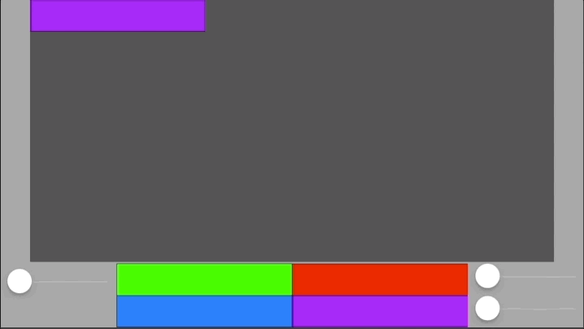

# coregraphics-drawing
a simple XCode project to test CoreGraphics drawing by translate and rotate.

# Preview
 

# Information
Just a simple iOS app to experiment with CoreGraphics drawing. As it is, the
drawing is done after coordinate conversion to UIKit's coordinates (flipped
  along the x-axis).
